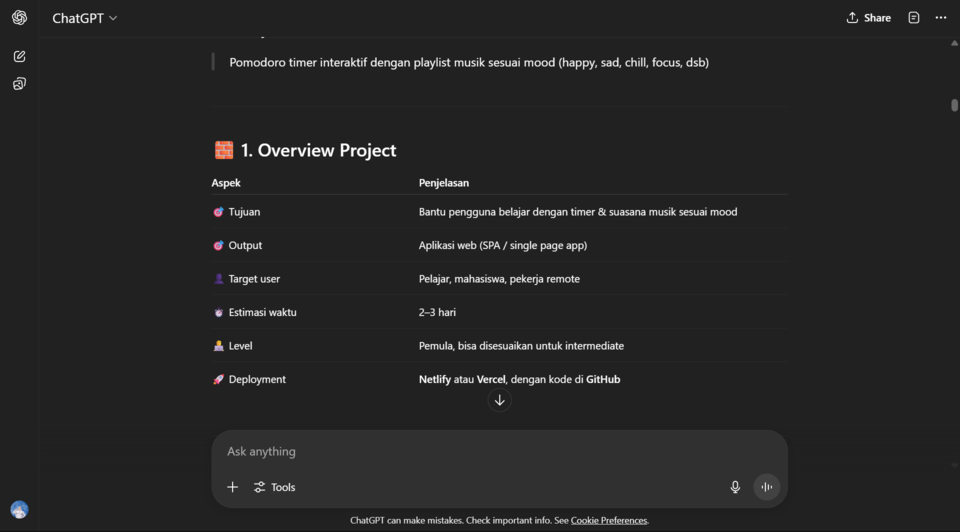
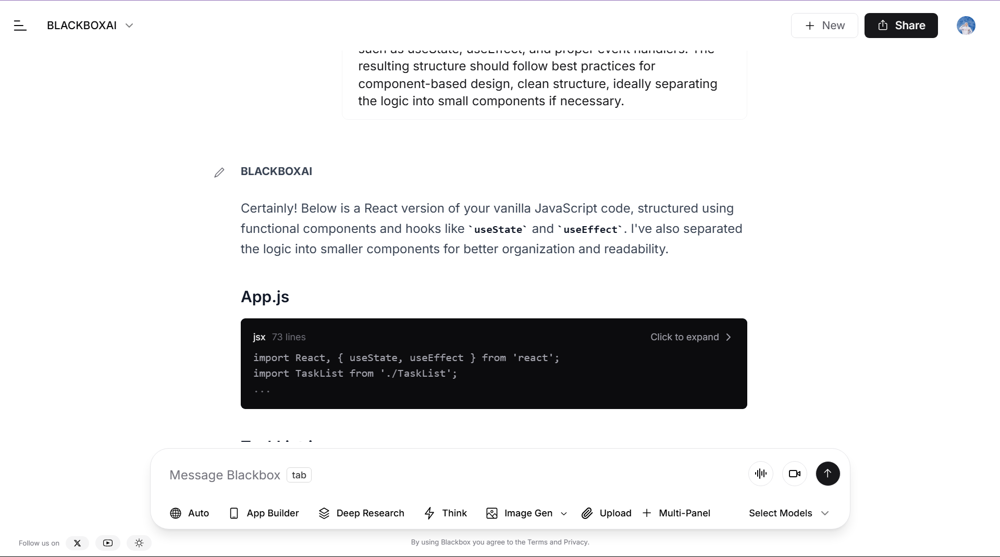

# 📚 Studify

**Studify** is a clean and minimal Single Page Application (SPA) built to help users manage their study sessions more effectively.  
It combines the popular **Pomodoro Technique** with a lightweight **Notes Tracker** for managing to-do lists during focused learning.  
Whether you're preparing for exams, tackling coding projects, or simply trying to stay productive, Studify is your go-to tool for structured time management and organization.

---

## 🔍 Description

Studify serves as a personal productivity assistant that allows users to:

- Break down study time into 25-minute focused sessions with short breaks
- Write and track their tasks using a built-in notes feature
- Stay motivated and avoid burnout using proven time management methods

Designed and built in as a personal coding challenge, this project aims to demonstrate both technical skill and creative problem-solving using modern tools, especially AI.

---

## 🛠️ Technologies Used

- ⚛️ **React** – Frontend framework for building dynamic user interfaces
- ⚡ **Vite** – Next-generation frontend tooling for fast builds and hot reloads
- 🎨 **CSS** – Styling and layout
- ☁️ **Vercel** – Seamless deployment and hosting

---

## ✨ Features

- 🕒 **Pomodoro Timer** — 25 minutes work, 5 minutes break cycle
- 📝 **Notes Tracker** — Simple to-do list for task management

---

## ⚙️ Setup Instructions

1. **Clone the repository**
   ```bash
   git clone https://github.com/your-username/studify.git
   cd studify
2. **Install dependencies**
   ```bash
   npm install
3. **Start the development server**
   ```bash
   npm run dev
4. **Build for production**
   ```bash
   npm run build
5. **Deployment**
- This project is deployed using Vercel
 👉 [https://studify-pearl.vercel.app](https://studify-pearl.vercel.app)

   ---
## 🤖 AI Support Explanation

As a beginner coder, I relied heavily on AI tools throughout this project to guide my learning and development process:

- 🧠 **ChatGPT** – Helped me create a detailed step-by-step development plan and guided the structure of each feature
- 🧩 **IBM Granite** – Assisted in generating functional code snippets from modular ideas
- 🔄 **Blackbox** – Enabled me to extract and refactor code from related open-source repositories

I also documented my process visually and can include supporting images showing how I integrated these tools to turn a simple idea into a functioning application.  
 

This project demonstrates not just my technical implementation skills, but also how AI tools can empower self-learning and accelerate development, especially for those just starting in the tech world.

---

## 👩‍💻 Author

**Afira**  
📍 *First year informatics student*  
🔗 Instatgram: [https://instagram.com/annxie.ty](https://instagram.com/annxie.ty)  
🔗 GitHub: [https://github.com/Afira911](https://github.com/Afira911)  

---

⭐ If you're a fellow learner or just someone looking for a simple study tool, feel free to **fork**, **clone**, or **contribute**!

